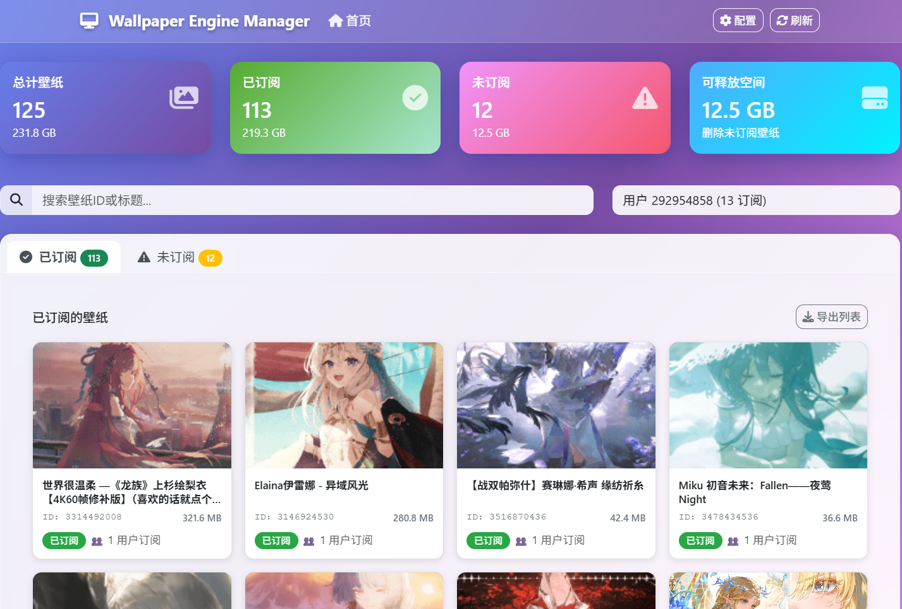

# Wallpaper Engine Web Manager

A web-based interface for managing Wallpaper Engine subscriptions using Flask backend and responsive frontend.




## Quick Start

1. Install dependencies:
```bash
pip install -r requirements.txt
```

2. Configure your Steam library path in `config.json` or in the web interface.

3. Run the development server:
```bash
python app.py
```

4. Open your browser to `http://localhost:5000`

## Project Structure

```
manager web/
├── app.py                 # Flask application entry point
├── config.json           # Configuration file
├── requirements.txt      # Python dependencies
├── static/               # Static assets (CSS, JS, images)
│   ├── css/
│   ├── js/
│   └── images/
├── templates/            # HTML templates
│   ├── base.html
│   ├── index.html
│   └── components/
├── api/                  # Backend API modules
│   ├── __init__.py
│   ├── wallpaper.py
│   └── config.py
└── utils/                # Utility functions
    ├── __init__.py
    ├── steam_parser.py
    └── image_processor.py
```
